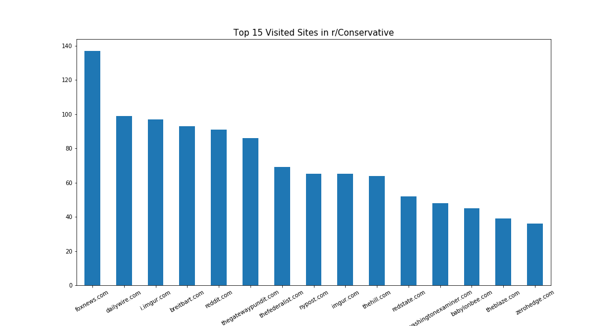
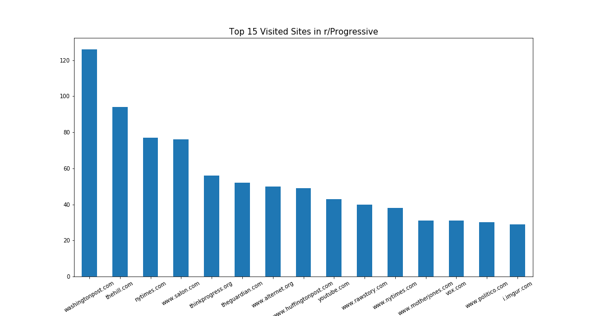
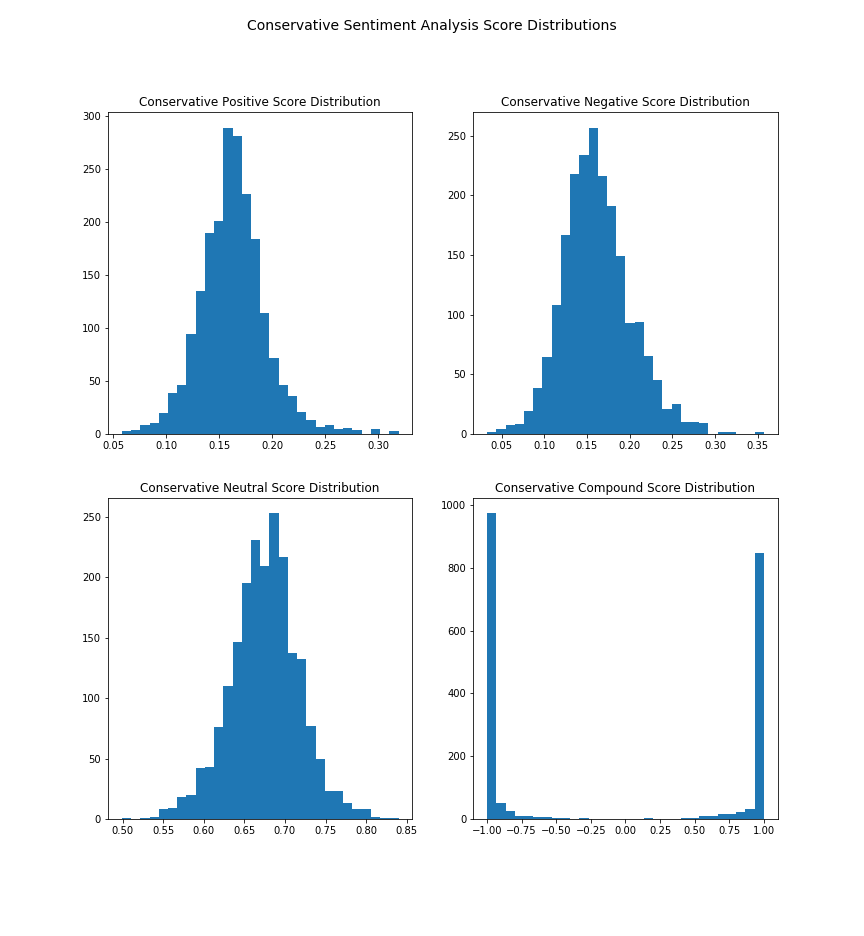
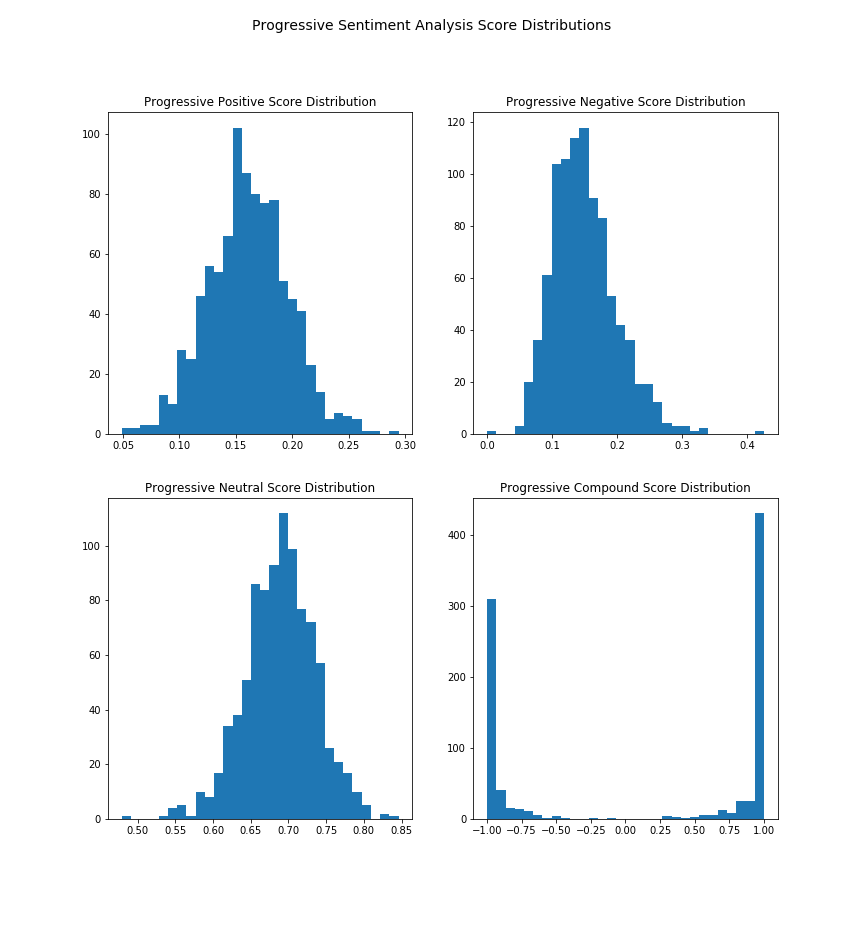
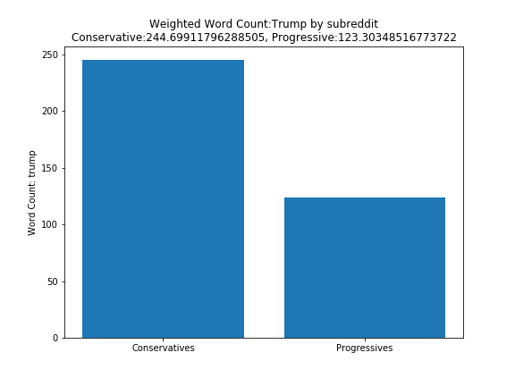
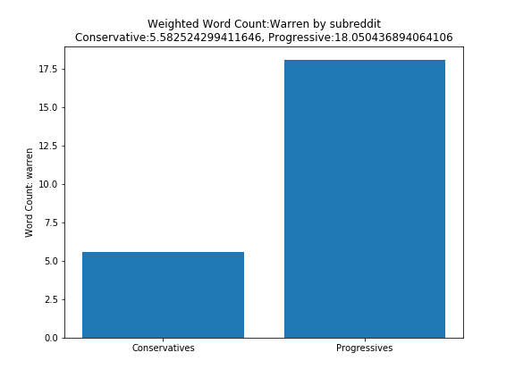
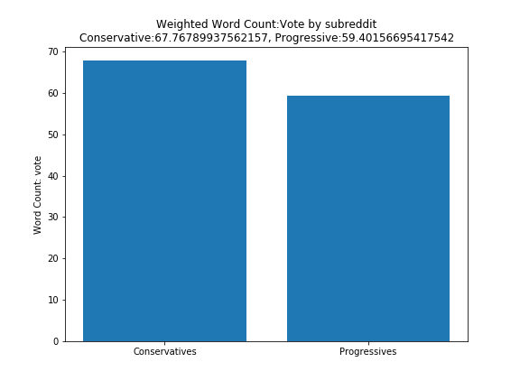
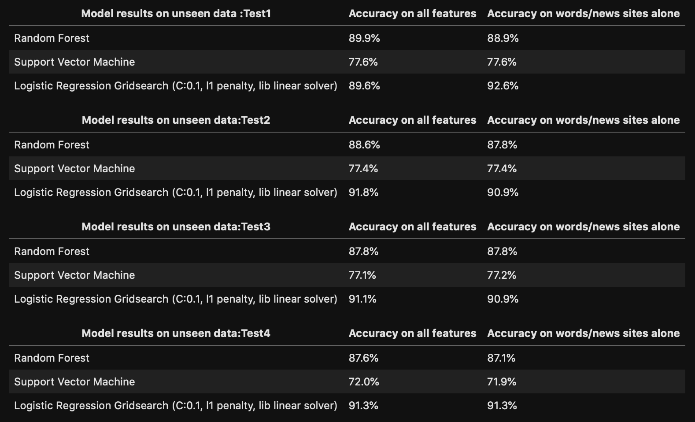

## Problem Statement
---
My client is a psychological research group. They are in the beginning stages of gathering data, for a study invovling both the extent of, and psychological impact of, an ever increasing sense of division and hostility revolving around politics. I am tasked with finding evidence supporting this assumption to confirm or refute it, both by data analysis and statistical modelling. The goal is to be able to identify text of a political group, and then correctly classify new text data from those same groups based on similarities, as this will prove a strong separation of the data. A number of classifier models will be used, with an emphasis on accuracy, as there is no particular worry about misclassifying one way or the other. 

The methodology of assesing the extent of division will revolve around two measurable factors. The first is an analysis of the overlap of news sources. Are these two communities getting their information from the same sources? If so, to what ratio? A lack of overlap in sources of news consumption could be an indicator of further division among both ideologies. 

The second factor is an analysis of topics discussed. As this is a data science study utilizing very large quantities of text data, a reading assessment would not be feasible. Rather, an analysis of word count and importance will be conducted. A sentiment analysis of bodies of text by reddit post will also be attempted to the extent possible given data size limitations.

My client is likewise interested in the ability to algorithmically predict which political class a post belongs to, to serve as evidence of these correlations.

### Data Used
---
In this study, an attempt to statistically quanitfy such a level of political division will be attempted. The data utilized involves online communication and news gathering from the online website [reddit](reddit.com). In such communities, a true level of potential division can be established, as users may feel more unibhibited in expressing negative or divisive opinions than they might be in personal discussions. The reddit community has a large number of "subreddits," sub communities revolving around a singular topic, ranging from scientific study to philosophical discussions to [photographs of cats](reddit.com/r/cats).

For the sake of political ideological comparison, two subreddits will be chosen along the right and left leaning portions of the political spectrum. Politcal parties are not being utilized (Republicans and Democrats), as this study is less concerned with political parties and more the potential effects of strong political ideologies.
  - Initially, the two subreddits chosen were [Conservative](reddit.com/r/Conservative) and [Liberal](reddit.com/r/Liberal). Upon analysis, however, the Liberal subreddit was far less active, leading to a large imbalance in my dataset. I therefore decided to use a different left leaning subreddit called [Progressive](reddit.com/r/Progressive), as it proved to be far more active.
  
## Methodology
---

### Data Acquisition
---
Data was acquired with Python Reddit Api Wrapper (Praw). 1000 posts each were drawn, sorted by new, top scored, and controversial (both up and downvoted) in both subreddits. To get enough data for sufficient model training, this was repeated multiple times, concatenated into the existing dataframe, and then duplicates were dropped (by post id and title), keeping the last entry to maintain the most recent karma score and comment number at the time of data acquisition. 

Using Praw's [commentforest](https://praw.readthedocs.io/en/latest/code_overview/other/commentforest.html), comments were also gathered on the data. The depth was limited to 1 "child" comment, and only half of the posts (with the highest number of posts) had thier comments gathered, due to time restrictions (even the comments that I gathered took multiple hours to run!). 

There was no use of train_test_split in model training and testing, as this same process was done to collect fresh test data many times. The last training data was collected on Sunday, October 18, and the first test data was collected Tuesday, October 20, to ensure that enough new posts had populated the subreddits to allow for testing data to be gathered. Test data was drawn periodically over a period of roughly 3 days, at least 8-10 hours apart, to give time for new posts to populate on each subreddit.

## Data Cleaning
---
There was very little data cleaning to do in this data. For each row, prior to analysis, all text documents were combined into a single "text" column that was then vectorized (combining title, body and comments (when available for each) into a single feature). 

Most cleaning was done in the Data and Test Acquisition Notebooks.

### Data Analysis and EDA
----
- The data shows that only 11% of news sites used in both subreddits were used by both subreddits in common. This is particularly of note because a large number of listed sites involved youtube, imgur, reddit, and other sources of images and media that are not news sources, implying that even fewer news sites are actually shared among both subreddits.

- A sentiment analysis showed that there was not a significant difference in sentiment analysis of text in any sentiment scores except for negative word scores. The interpretability even of this is difficult, however, as conservatives had higher negative scores at the low end of the negative score distribution, but progressives had higher negative scores at the higher end of the negative score distribution.

- Of words analyzed between both subreddits (which were purposefully political "buzzwords", such as political figures, groups, and current events), words consistently showed very sharp differences in "importance" between both subreddits, again showing evidence of polarization among these groups. Interestingly, one of the only words held about equally important among both subreddits was the word "vote."

### Preparation for modelling
---
Normally, string values are converted to to numeric values or dummied in order to give the model numbers to work with. In this case, however, the words themselves were the values I wished to evaluate. Therefore, the words were turned into features via a TF-IDF vectorizer. 

The sites were dummied in order to maintain their predictive power as well, as these were the features most important in showing evidence for my client's study. 

### Modelling
---
As this is a binary classification problem, three classifier models were employed to predict subreddits on unseen test data. These three models were a Random Forest Classifier, a Support Vector Machine Model, and a simple Logistic Regression model. 

In addition to the feature engineering of word vectorizing, scaling was also necessary prior to SVM modelling and Logistic Regression, as one is a distance estimator, and the other is a logarithmic funtion that utilizes regularization (which must be scaled prior to operation).

Due to the large size of the data (after word vectorization, the training data matrix had almost 6000 rows and 4500 columns), gridsearching over the Random Forest and SVM models proved too time consuming. Tuning of hyperparameters was attempted during modelling, however the default parameters largely scored best in both cases.

The Logistic Regressor was gridsearched over, to find the best regularization strengths. This was critical, as the vast number of features led to a near certainty of overfitting the data.

### Model Results
---

As the test data was acquired equally for both classes, the baseline accuracy score was 50%. The results indicate consistent predictive power over the features described above. 

- SVM had highest bias and variance of all models

- Random Forest Classifier consistently scores accuracy of 87.1-88.9% on unseen words and news site data

- Linear Regression model scores same data between 90.9-92.6%, showing least bias and variance of all models

## Conclusion
---
- There were only 122 sites out of all of the 1116 news sites used as reddit news sources that are shared among the different political subreddits. That accounts for 11% of all of the unique news sites that are in the dataset. 

- Interestingly, the conservative subreddit has higher scores values in the 5 number summary in the sentiment analysis of positive scores (though not by a lot) compared to the progressive subreddit. 

- The conservative subreddit also has slightly higher negative scores for most of the 5 number summary, though the maximum negative score of the progressive subreddit is a higher value.

*Some caveats - people other than subscribers can post comments, so the sentiment of comments may not always reflect the people who post or even frequently view the various subreddits. Both subreddits appear to periodically complain of "brigading," where people opposed to their political views leave negative or even abusive comments. Whether this assertion is true, or part of a potentially interesting psychological phenomenon involving highly politically active online users on both sides of the political spectrum, is unknown, but perhaps an area that will warrant further investigation.*

- An analysis of political keywords (names of candidates and prominient politcial figures, as well as current events words) showed that most words were divisive among the groups, with each subreddit apparently discussing different topics.

- Of all models used, the Logistic Regression model performs consistently with the lowest bias and variance. Taken with findings of EDA, this study serves as evidence of a real polarization of ideas and topics of interest among political ideology groups.

- Interestingly, when a subreddit is misclassified, the model tends to falsely classify actual progressive posts as Conservative ones, and less so the other way around. This likely has to do with the higher level of activity in that subreddit, in terms of commenting and posting.

**NOTE:** Given the constantly changing poltical landscapes, topics discussed, and typical "buzzwords," it is important to note that the EDA of word choices done in this study will be irrelevant outside of the period of time of this study (October of 2020). However, the model can be retrained with new words by collecting new data in the Data_Acquisition notebook, then utilizing that data to retrain the models in this notebook. 

## Recommendations from this study
---
It would appear that there is evidence of both isolation (getting news from entirely different sources) and division (separation of topics discussed and read about) with respect to politically active people on both ends of the political spectrum. This is no mere difference of opinions - this is people having completely different conversations, reading different sources, and in essence living completely different existences in the same country. 

With this project as evidence of such division, further studies can be conducted on the effects of such divisions on those who are politcially active, potential risk factors of such political divides on individual psyches, as well as potential methods of effecting some level of compromise and coexistence among ever more separated communities.
